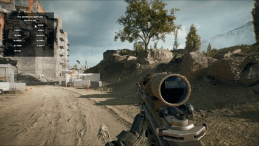
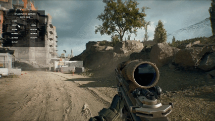
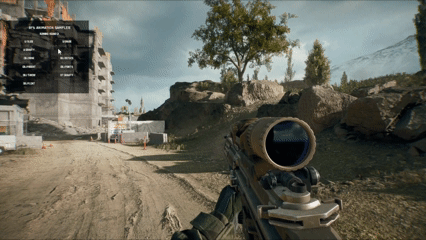
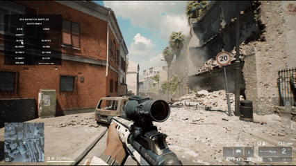
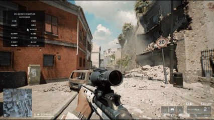
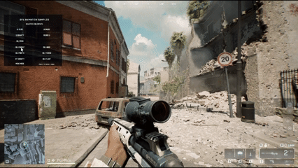
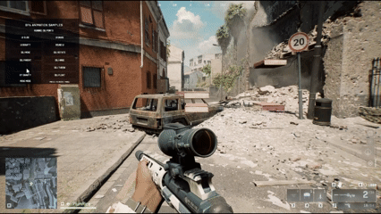
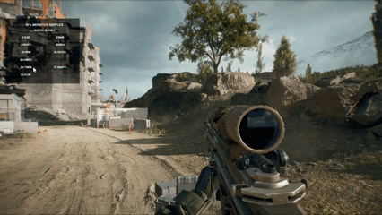
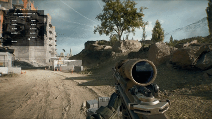
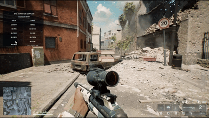

# bf6-animation

[Japanese version](./README-JP.md)

Animation helpers for BF6 Portal TypeScript. They let you animate UI and spawned objects with timeline-style code.

The animation script files are `mods/bf6-*.ts`. In this repository, the sample implementations are in `mods/Samples.ts`, and the Portal event entry points are in `mods/Script.ts`.

The API notes in this README were checked against Portal SDK 1.2.3.0 types, including `mod.Wait`, UI creation/update APIs, button events, `mod.SpawnObject`, and `mod.SetObjectTransform`.

## Features

- `uiTimeline()` animates UIWidget position, size, background color, alpha, text, image, and button color properties in sequence.
- `objectTimeline()` animates `mod.Object` position, rotation, and enabled state.
- Passing an array to `to()` animates multiple UI widgets or objects during the same timeline step.
- `wait()` adds a delay, `call()` runs custom logic, and `loop` repeats a timeline.
- `RuntimeObject` creates composite objects with parent-child relationships and propagates parent movement/rotation to children.
- `GravityWorld` adds lightweight gravity-driven movement to UI widgets, normal objects, and `RuntimeObject` instances.

This is not a replacement for the game engine's physics. It is a lightweight presentation system that updates positions and display state from script in small steps.

## Notes

- The more elements you animate, the higher the server load becomes. For information shared by all players, create UI without a `receiver`. For team-shared information, pass a `Team` to the `receiver` argument of APIs such as `AddUIContainer`. If UI does not need to be player-specific, prefer shared display.
- The default `step` is `1 / 15`. Smaller steps look smoother, but they increase the number of Portal updates and therefore increase server load.
- `GravityWorld` updates each registered body once, so its cost is `O(N)`. It does not provide collision detection or pushing between objects.
- UI Y coordinates and world Y coordinates may use different directions. The UI falling sample treats positive Y as downward, while the object throwing sample uses negative Y as gravity.

## File Layout

```text
mods/
  Script.ts                Portal event functions. Creates the sample menu and handles button input
  Samples.ts               Sample UI, object, and gravity animations
  bf6-ui-animation.ts      Timeline implementation for UIWidget
  bf6-object-animation.ts  Timeline implementation for mod.Object and RuntimeObject
  bf6-gravity.ts           Lightweight gravity simulation
  bf6-easings.ts           Easing functions
dist/
  Script.ts                Portal script generated by npm run build
  Strings.json             Strings registered in Portal
```

### Usage In Your Own Program

To use these animation scripts in your own program, use a BF6 Portal template that can merge multiple files, such as `deluca-mike/bf6-portal-scripting-template` or `link1345/Battlefield6-SampleTemplate`. Put `mods/bf6-*.ts` into your working folder, then merge the files when registering source code in the Portal editor. The `mods/bf6-*.ts` files are large enough that keeping them merged into one file while coding is not recommended.

## Sample Usage

1. Install dependencies.

```sh
npm install
```

2. Merge the TypeScript files into one Portal script.

```sh
npm run build
```

3. Register the generated `dist/Script.ts` and the existing `dist/Strings.json` in the BF6 Portal web editor.

4. Start the Portal experience. When a player deploys, the sample menu appears in the upper-left corner.

`mergeScript.js` reads `.ts` files under `mods`, removes static imports, and combines them into `dist/Script.ts`. Upload the built `dist/Script.ts`, not the individual files under `mods`.

## Portal APIs Used

In the Portal TypeScript types, `mod.Wait(n)` receives a duration in seconds and returns `Promise<void>`. This library interpolates values by repeatedly calling `await mod.Wait(step)` on each tick.

UI is created with `mod.AddUIContainer`, `mod.AddUIText`, `mod.AddUIImage`, and `mod.AddUIButton`, then updated with APIs such as `mod.SetUIWidgetPosition`, `mod.SetUIWidgetSize`, and `mod.SetUITextAlpha`. Button input is enabled with calls such as `mod.EnableUIButtonEvent(widget, mod.UIButtonEvent.ButtonDown, true)` and received by `OnPlayerUIButtonEvent`.

Objects are spawned with `mod.SpawnObject(prefab, position, rotation, scale)` and moved/rotated with `mod.SetObjectTransform(object, mod.CreateTransform(position, rotation))`. The sample uses `mod.RuntimeSpawn_Common.Crate_01_A`.

Player-relative object positions are calculated with `mod.GetSoldierState(eventPlayer, mod.SoldierStateVector.GetPosition)` and `mod.GetSoldierState(eventPlayer, mod.SoldierStateVector.GetFacingDirection)` so boxes can spawn in front of the player.

## Basic Code

This example slides in a notification from the upper right, enlarges its title, waits briefly, then hides it.

```ts
import { uiTimeline } from "./bf6-ui-animation";

await uiTimeline()
    .to(panel, { visible: true, x: 34, bgAlpha: 0.9 }, { duration: 0.25, ease: "outCubic" })
    .to(accent, { visible: true, width: 720, bgAlpha: 1 }, { duration: 0.18, ease: "outCubic" })
    .to(title, { textAlpha: 1, textSize: 50 }, { duration: 0.2, ease: "outBack" })
    .wait(1.2)
    .to(title, { textAlpha: 0 }, { duration: 0.12, ease: "inCubic" })
    .to(panel, { x: -820, bgAlpha: 0, visible: false }, { duration: 0.22, ease: "inCubic" })
    .play();
```

`to()` steps run in order. `duration` is in seconds, and `ease` controls the interpolation curve. `visible: true` is applied before the animation starts, while `visible: false` is applied after the animation finishes.

Pass an array to animate multiple targets during the same step.

```ts
await uiTimeline()
    .to([
        { target: fill, props: { position: [0, -292, 0], size: [760, 36], bgColor: [0.25, 1, 0.45] } },
        { target: edge, props: { x: 380, bgColor: [0.72, 1, 0.82] } },
        { target: label, props: { textColor: [0.25, 1, 0.72], textSize: 46 } },
    ], { duration: 0.34, ease: "outBack" })
    .play();
```

## Simple UI Implementation

The samples use helper functions such as `addPanel()` and `addText()`, but a minimal setup can call Portal APIs directly. This example creates a panel and text when a player deploys, then uses `uiTimeline()` to show, move, and fade them out.

```ts
import { uiTimeline } from "./bf6-ui-animation";

export async function OnPlayerDeployed(eventPlayer: mod.Player): Promise<void> {
    const panelName = `simple-panel-${mod.GetObjId(eventPlayer)}`;
    const textName = `simple-text-${mod.GetObjId(eventPlayer)}`;

    if (mod.HasUIWidgetWithName(panelName)) {
        mod.DeleteUIWidget(mod.FindUIWidgetWithName(panelName));
    }

    mod.AddUIContainer(
        panelName,
        mod.CreateVector(0, -80, 0),
        mod.CreateVector(520, 132, 0),
        mod.UIAnchor.Center,
        mod.GetUIRoot(),
        false,
        8,
        mod.CreateVector(0.02, 0.04, 0.07),
        0,
        mod.UIBgFill.Solid,
        mod.UIDepth.AboveGameUI,
        eventPlayer,
    );

    const panel = mod.FindUIWidgetWithName(panelName);

    mod.AddUIText(
        textName,
        mod.CreateVector(0, 0, 0),
        mod.CreateVector(520, 132, 0),
        mod.UIAnchor.Center,
        panel,
        true,
        0,
        mod.CreateVector(0, 0, 0),
        0,
        mod.UIBgFill.None,
        mod.Message("SIMPLE UI"),
        34,
        mod.CreateVector(1, 1, 1),
        0,
        mod.UIAnchor.Center,
        mod.UIDepth.AboveGameUI,
        eventPlayer,
    );

    const text = mod.FindUIWidgetWithName(textName, panel);

    await uiTimeline()
        .to(panel, { visible: true, y: -40, bgAlpha: 0.9 }, { duration: 0.25, ease: "outCubic" })
        .to(text, { textAlpha: 1, textSize: 44 }, { duration: 0.2, ease: "outBack" })
        .wait(1)
        .to([
            { target: text, props: { textAlpha: 0, visible: false } },
            { target: panel, props: { y: -100, bgAlpha: 0, visible: false } },
        ], { duration: 0.25, ease: "inCubic" })
        .play();
}
```

## Sample Behavior

- Sample widget names include the player ID to avoid name collisions across multiple players.
- Each sample registers `control?.onCancel(() => timeline.stop())` so a running sample can be stopped.

### UI SLIDE


A wide notification panel slides in from the upper right. A thin accent bar expands, the title text pops larger, then the whole panel slides away to the left.

```ts
export async function sampleUiSlideNotification(eventPlayer: mod.Player, control?: SampleAnimationControl): Promise<void> {
    const playerId = samplePlayerId(eventPlayer);
    const panelName = `sampleUiSlideNotification-${playerId}-panel`;
    const accentName = `sampleUiSlideNotification-${playerId}-accent`;
    const titleName = `sampleUiSlideNotification-${playerId}-title`;

    resetWidgets([panelName]);

    const panel = addPanel(panelName, v(-820, 64), v(720, 164), mod.UIAnchor.TopRight, eventPlayer);
    mod.AddUIContainer(accentName, v(0, 0), v(0, 10), mod.UIAnchor.TopLeft, panel, false, 0, v(0.1, 0.85, 1), 0, mod.UIBgFill.Solid, eventPlayer);
    const accent = findWidget(accentName, panel);
    const title = addText(titleName, panel, mod.stringkeys.sample_ui_slide_title, v(36, 14), v(648, 136), 36, eventPlayer);

    const timeline = uiTimeline()
        .to(panel, { visible: true, x: 34, bgAlpha: 0.9 }, { duration: 0.25, ease: "outCubic" })
        .to(accent, { visible: true, width: 720, bgAlpha: 1 }, { duration: 0.18, ease: "outCubic" })
        .to(title, { textAlpha: 1, textSize: 50 }, { duration: 0.2, ease: "outBack" });

    control?.onCancel(() => timeline.stop());
    await timeline.play();
}
```

### UI GAUGE



The gauge appears near the center of the screen and fills in stages. Its color shifts from blue to yellow, red, and finally green, making it useful for charge-up or objective-progress effects.

```ts
const timeline = uiTimeline()
    .to(panel, { y: -314, bgAlpha: 0.9 }, { duration: 0.18, ease: "outCubic" })
    .to(label, { textAlpha: 1, textSize: 42 }, { duration: 0.16, ease: "outBack" })
    .to([
        uiItem(fill, { position: [-250, -292, 0], size: [260, 36], bgColor: [0.2, 0.75, 1] }),
        uiItem(edge, { x: -120, bgColor: [0.65, 0.95, 1] }),
    ], { duration: 0.32, ease: "outCubic" })
    .to([
        uiItem(fill, { position: [0, -292, 0], size: [760, 36], bgColor: [0.25, 1, 0.45] }),
        uiItem(edge, { x: 380, bgColor: [0.72, 1, 0.82] }),
        uiItem(label, { textColor: [0.25, 1, 0.72], textSize: 46 }),
    ], { duration: 0.34, ease: "outBack" });
```

If only `fill` width is changed, it appears to expand from its center. The sample moves `position` and `size` together so the left edge appears fixed.

### UI GRAVITY



A question mark drops diagonally from above. After it lands, the shadow expands and both the icon and shadow fade out. `GravityWorld` drives the movement, while the timeline controls the sequence: run physics, expand shadow, hide elements.

```ts
const gravity = new GravityWorld({ gravity: [0, 920, 0] })
    .add(uiGravityBody(icon, { velocity: [260, -180, 0], groundY: 170 }));

const timeline = uiTimeline()
    .to(shadow, { bgAlpha: 0.12, width: 24 }, { duration: 0 })
    .physics(gravity, { duration: 1.05, step: 1 / 15 })
    .to(shadow, { bgAlpha: 0.4, width: 128 }, { duration: 0.16, ease: "outCubic" })
    .wait(0.6)
    .to([
        { target: icon, props: { imageAlpha: 0, visible: false } },
        { target: shadow, props: { bgAlpha: 0, visible: false } },
    ], { duration: 0.2, ease: "inCubic" });
```

For UI coordinates, this sample assumes positive Y is downward, so gravity is positive Y and the initial upward velocity is negative Y.

### ROUND UI



A large round-change style announcement appears in the center of the screen. A horizontal line expands, title and subtitle text appear, then everything collapses away after a short wait.

```ts
const timeline = uiTimeline()
    .to(panel, { visible: true, bgAlpha: 0.62 }, { duration: 0.15, ease: "outCubic" })
    .to(line, { x: 0, width: 980, bgAlpha: 1 }, { duration: 0.22, ease: "outCubic" })
    .to(title, { textAlpha: 1, textSize: 82 }, { duration: 0.26, ease: "outBack" })
    .to(subtitle, { textAlpha: 1, y: 150 }, { duration: 0.18, ease: "outCubic" })
    .wait(1.1)
    .to([
        { target: title, props: { textAlpha: 0, y: 28 } },
        { target: subtitle, props: { textAlpha: 0, y: 184 } },
        { target: line, props: { bgAlpha: 0, width: 0, x: 490 } },
    ], { duration: 0.22, ease: "inCubic" });
```

### OBJ MOVE



A box appears in front of the player, then moves left/right and up/down. `sampleObjectPoint()` calculates right, up, and forward offsets from the player's current position and facing direction.

```ts
const object = spawnSampleObject(prefab, sampleObjectPoint(eventPlayer, -1.2, 1.2, 3), v(0, 0, 0), v(1.8, 1.8, 1.8));

const timeline = objectTimeline()
    .to(object, { position: sampleObjectPointArray(eventPlayer, 1.2, 2, 3) }, { duration: 0.45, ease: "outCubic" })
    .to(object, { position: sampleObjectPointArray(eventPlayer, -1.2, 2, 3.8) }, { duration: 0.45, ease: "inOutCubic" })
    .to(object, { position: sampleObjectPointArray(eventPlayer, 0, 1.2, 3) }, { duration: 0.45, ease: "outBack" });
```

The player-relative point is built like this.

```ts
const position = mod.GetSoldierState(eventPlayer, mod.SoldierStateVector.GetPosition);
const facing = mod.GetSoldierState(eventPlayer, mod.SoldierStateVector.GetFacingDirection);
const forwardX = mod.XComponentOf(facing) / facingLength;
const forwardZ = mod.ZComponentOf(facing) / facingLength;
```

### OBJ ROTATE



A box appears in front of the player, rotates by yaw, tilts with pitch and roll, then performs a full rotation. Portal object rotation is handled through the X/Y/Z components of a `mod.Vector`; this library exposes those as `pitch`, `yaw`, and `roll`.

```ts
const timeline = objectTimeline()
    .to(object, { yaw: Math.PI / 2 }, { duration: 0.4, ease: "outCubic" })
    .to(object, { pitch: Math.PI / 5, roll: -Math.PI / 8 }, { duration: 0.4, ease: "inOutCubic" })
    .to(object, { rotation: [0, Math.PI * 2, 0] }, { duration: 0.6, ease: "linear" });
```

### OBJ PARENT



This sample demonstrates `RuntimeObject` parent-child transforms. It creates a large parent box and a smaller child box. The parent moves forward while the child rotates, then the parent rotates as a whole and the child follows it.

```ts
const parent = new RuntimeObject(prefab, sampleObjectPointArray(eventPlayer, 0, 1.2, 3.2), [0, 0, 0], [0, 1, 0], 0, [1.8, 1.8, 1.8]);
const child = parent.NewChild(prefab, [0, 0.25, 1.4], [0, 0, 0], [0, 1, 0], 0, [0.9, 0.9, 0.9]);

const timeline = objectTimeline()
    .to([
        { target: parent, props: { moveBy: [0, 0, 1.2] } },
        { target: child, props: { qRotateBy: { axis: [0, 1, 0], angle: Math.PI * 2 } } },
    ], { duration: 1.2, ease: "inOutCubic" })
    .to(parent, { qRotateBy: { axis: [0, 1, 0], angle: Math.PI } }, { duration: 0.8, ease: "outCubic" });
```

`RuntimeObject` stores rotation internally with quaternions, then applies the result to Portal through `mod.SetObjectTransform`.

### OBJ POINTS



A box travels through multiple points. Short `wait(0.1)` gaps make it feel like it is hitting beats instead of moving along one continuous line.

```ts
const timeline = objectTimeline()
    .to(object, { position: sampleObjectPointArray(eventPlayer, -0.7, 2.8, 3.2) }, { duration: 0.35, ease: "outCubic" })
    .wait(0.1)
    .to(object, { position: sampleObjectPointArray(eventPlayer, 0.7, 1.7, 2.7) }, { duration: 0.35, ease: "inOutCubic" })
    .wait(0.1)
    .to(object, { position: sampleObjectPointArray(eventPlayer, 1.8, 3.4, 3.7) }, { duration: 0.35, ease: "outBack" })
    .to(object, { position: sampleObjectPointArray(eventPlayer, 0, 1.2, 3.2) }, { duration: 0.5, ease: "inOutCubic" });
```

### OBJ THROW



A normal `mod.Object` is connected to `GravityWorld` to create a forward throwing arc. In world coordinates, Y is treated as upward here, so gravity is negative Y.

```ts
const start = sampleObjectPoint(eventPlayer, -1.4, 1.1, 3);
const object = spawnSampleObject(prefab, start, v(0, 0, 0), v(1.8, 1.8, 1.8));
const groundY = mod.YComponentOf(start) - 1.2;

const gravity = new GravityWorld({ gravity: [0, -9.8, 0] })
    .add(objectGravityBody(object, { velocity: [6, 8, 0], groundY }));

await objectTimeline()
    .physics(gravity, { duration: 1.2, step: 1 / 15 })
    .play();
```

### RT GRAVITY



A parent-child `RuntimeObject` composition falls as one unit. `runtimeObjectGravityBody()` adapts `GravityWorld` movement into `object.Move(delta)` and `object.ApplyTransform()`.

```ts
const runtime = new RuntimeObject(prefab, [mod.XComponentOf(start), mod.YComponentOf(start), mod.ZComponentOf(start)], [0, 0, 0], [0, 1, 0], 0, [1.7, 1.7, 1.7]);
runtime.NewChild(prefab, [0, 0, 1.4], [0, 0, 0], [0, 1, 0], 0, [0.85, 0.85, 0.85]);

const gravity = new GravityWorld({ gravity: [0, -9.8, 0] })
    .add(runtimeObjectGravityBody(runtime, { velocity: [0, 1, 0], groundY }));

await objectTimeline()
    .physics(gravity, { duration: 1, step: 1 / 15 })
    .play();
```

### OBJ FLOAT



This sample does not tween the Y coordinate directly. Instead, it flips the gravity direction during the timeline to make the box float up and down. Use `call()` when you need to change a value in the middle of a timeline.

```ts
const gravity = new GravityWorld({ gravity: [0, 7.5, 0] })
    .add(objectGravityBody(object, { velocity: [0, 1.2, 0] }));

const timeline = objectTimeline()
    .physics(gravity, { duration: 0.22, step: 1 / 15 })
    .call(() => { gravity.gravity = [0, -8.5, 0]; })
    .physics(gravity, { duration: 0.45, step: 1 / 15 })
    .call(() => { gravity.gravity = [0, 8.5, 0]; })
    .physics(gravity, { duration: 0.45, step: 1 / 15 });
```
